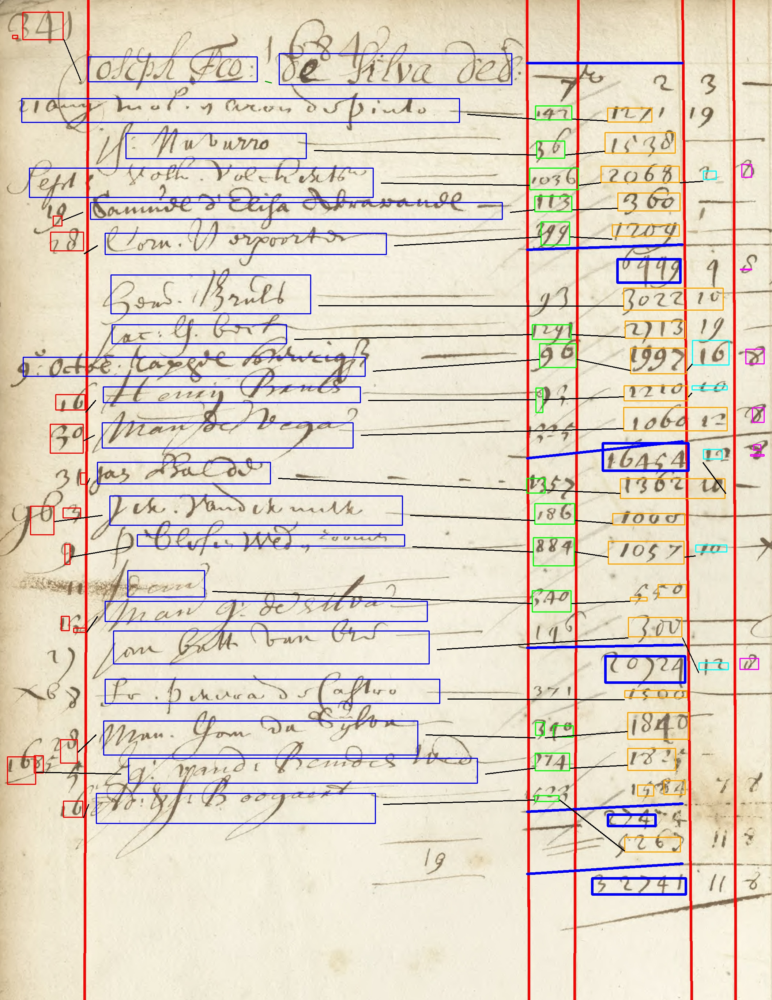

# 2025-IS-DS-thesis
Repository for my 2025 thesis (Master Information Studies, track data science)

## Abstract
The ledgers of the Amsterdamse Wisselbank (Bank of Amsterdam), spanning 1650 to 1800, provide a rich dataset for understanding economic and social dynamics of the early modern period. However, the handwritten and tabular nature of these documents, comprising half a million pages, poses significant challenges for digitization. While existing handwriting text recognition (HTR) tools such as Transkribus and Loghi excel in linear text transcription, they struggle with the structural complexities of tabular data.

This thesis introduces a novel approach to digitizing these ledgers, combining domain-specific knowledge with algorithmic techniques. Key innovations include the automated identification of ledger layouts, column and row structures, and the application of contextual constraints to improve recognition accuracy. Subtotal validation and domain-specific rules further enhance data reliability. Evaluations demonstrate significant improvements over baseline methods, achieving reductions in character error rate (CER) and higher accuracy in row alignment.

This thesis advances the state-of-the-art in digitizing tabular historical data for the Bank of Amsterdam and lays a foundation for future studies to develop fine-tuned models and validation techniques, enabling broader application across other historical datasets.

## Example 
An example transcription can be found here. The corresponding HTR result is below the image.

|     | Entry                          | Column 3 | Column 4 | Column 5 |
|-----|------------------------------|----------|----------|----------|
| 341 | Joseph Plo: de silve deb:    |          |          |          |
| 21  | aug mos. en aron de pinto.   | 42       | 127      |          |
|     | Navarro                      | 136      | 1538     |          |
|     | Sept volk. Volckerts         | 1036     | 2068     | 2        |
| 19  | Samuel d'Elisa Abravanel     | 113      | 360      |          |
| 28  | Corn. Verpoorter             | 299      | 1209     |          |
|     |                              |          | 6449     |          |
|     | Hend. Bruls                  |          | 302210   |          |
|     | Jac: ls. beck                | 11291    | 2713     |          |
| 9e octob | octob Taphel Henrigsz   | 96       | 997      | 16       |
| 16  | Henrij Bruls                 | 9        | 1210     | 10       |
| 30  | man de Vega                  |          | 1064 12  |          |
|     |                              |          | 16454    |          |
| 10  | Jan Balde                    | 135      | 1362 10  | 12       |
| 16  | jek. vander meer             | 186      | 1000     |          |
| 9   | blesen wede & zoonen         | 884      | 1057     | 10       |
|     | dom                          | 140      | 53       |          |
| 13  | man G: de Alva               |          |          |          |
|     | Jan batt van bre             |          | 300      | 12       |
|     |                              |          | 20724    |          |
|     | fr. perera de Castro         |          | 1500     |          |
| 28  | Man. Gon da Sijlor           | 132      | 1849     |          |
| 168 | g: van de Bemdes wed         | 174      | 1825     |          |
| 16  | Ad: & J: Boogaert            | 522      | 5263     |          |
|     |                              |          | 2740     |          |
|     |                              |          | 32741    |          |